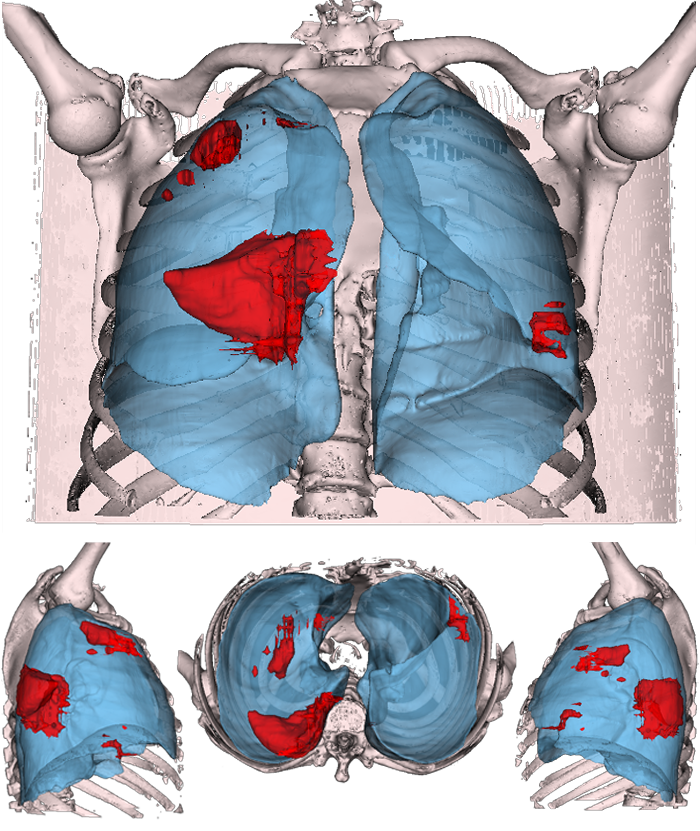

# A Deep Neural Network based approach for Domain Adaptation in 3D Segmentation of Lungs affected by COVID19 lesions
## Overview

<div align="center">
  
</div>
This repository provides the Jupyter Notebooks with the code of the algorithm described in the paper:

```
Stefano Giagu et al. "A Deep Neural Network based approach for Domain Adaptation in 3D Segmentation of Lungs affected by COVID19 lesions"
```

## Contents
- `all_tests.ipynb` contains the code used to train and test the different settings analyzed in the article
- `final_train-ipynb` contains the code used to train and test the proposed method

The trained model of our algorithm is stored on [Google Drive](https://drive.google.com/). ***to be added***

### How to use the Jupyter Notebooks:
In this section it is explained how to use the implemented code with a more in depth descrpition of its main parts.

#### all_tests
This Jupyter notebook has been implemented to be runned all in once with the purpose of testing different pre-processing techniques, architectures and hyper-parameters by choosing the desired settings in the initial configuration panel.

The ***first time only*** this code is executed it is fundamental to prepare the datasets by setting `preprocess_dataset=True`; this operation, usefull to reduce the training and testing time, consists in:
 1. creating appropriate paths to store input samples
 2. applying the volume normalization to rescale all the samples to the same dimensions 
 3. saving each slice of each orthogonal axis as `.npy` format
 
For future tests, the `preprocess_dataset` parameter has to be switched to `False`.

Intesity normalization and enchancements of the input samples are applied in real-time by the DataLoader. 

More information are included in the notebook as comments.

#### final_train
The code implemented in this file is a simplified version of `all_tests` where all the pre-processing and enhancement algorithms have been removed and only the one that achieved the best results is left. It is still possible to configure the initial panel to set different architectures and the relative hyper-parameters.

## Contact

For any request, please contact Professor Stefano Giagu at stefano.giagu@uniroma1.it.
